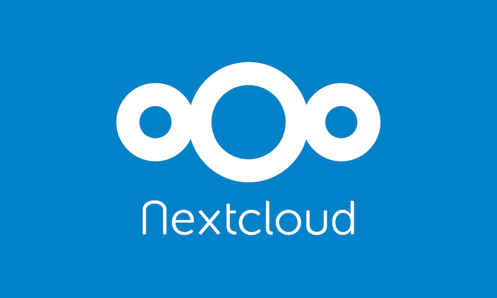
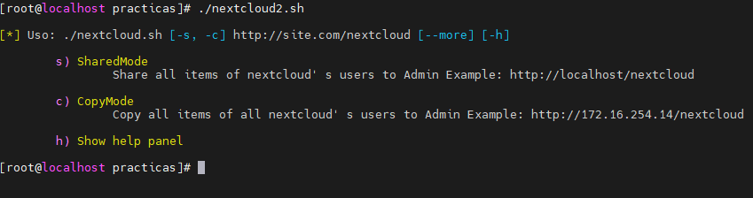
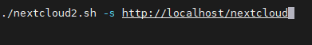
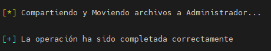
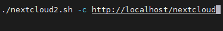

## Nextcloud 3 level of users

 

**Nextcloud** is a series of client-server programs that allow the creation of file hosting services. Its functionality is similar to Dropbox software, although Nextcloud is entirely open source. Nextcloud allows users to create private servers.

This tool manages to create 3 levels of users by simply playing with the APIs and WebDAV of FileManager users.

:warning: This tool is designed for use on a CentOs tested specifically in the version (CentOs 7)

### Usage
In order to execute it correctly you must specify the **url** without the last slash at the end so that there are no problems. There is a help panel with examples to make the execution clearer.

### Modos

##### SharedMode

This mode allows all files and folders of all users to be shared to the administrator user you have configured.

##### CopyMode

This mode is "undetectable" and allows you to copy all files and directories of all users to the Administrator user you have configured.

